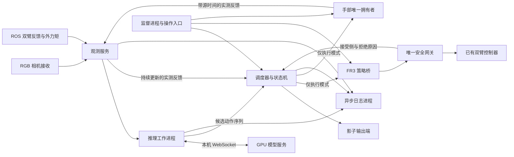
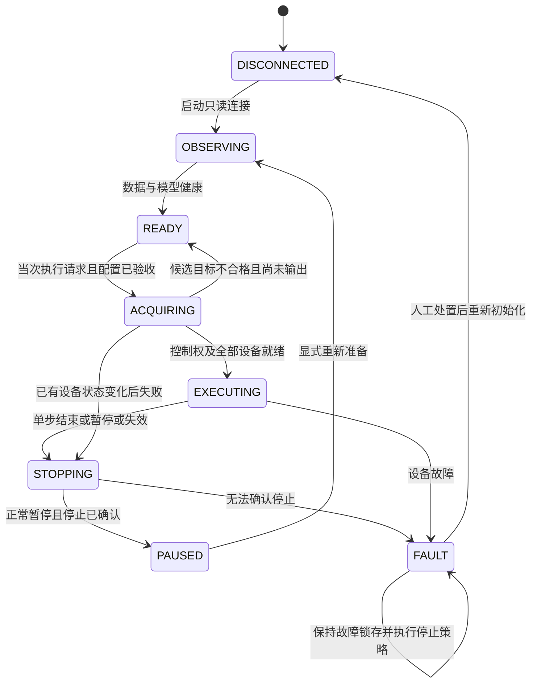

# FR3 / Wuji 执行客户端设计

状态：设计与实现边界，2026-09-08。软件核心和影子入口已实现，见 [EXECUTOR.md](EXECUTOR.md)；本文包含尚待完成的硬件与连续执行设计。`executor.example.yaml` 已由影子入口读取，但不构成真机运动配置。本次不实现硬件输出、不启动设备、不改变跳变阈值。

目标是把已有的真实观测和模型服务接入一个可记录、可停止、可交接的执行系统。所有新增代码、配置、构建产物留在 `Pi05`；`gello-retarget` 作为只读参考，保留原遥操启动方式。第一阶段先运行影子执行器，随后做受控单步验收，再评估连续闭环。

## 1. 已有基础与必须保留的约束

| 已有内容 | 复用方式 |
| --- | --- |
| `serve.py` / checkpoint `tomato_lora_ep65/19999` | 独立 GPU 服务，WebSocket 只推理，不接硬件 |
| `ObservationBuffer` | 三路 RGB 与实测关节匹配，保留源时间戳、接收时刻和时效检查 |
| RGB 相机配置 | 640×400 头部、640×480 双腕；只启 RGB，不改原遥操文件 |
| 推理记录与动作诊断 | 复用关节顺序、范围检查和原始输出记录；拆出当前同步 NPZ 保存 |
| 原安全网关 / 双臂控制器 | 保留限位、接管、限速、接触检查；策略只通过网关接入 |
| Wuji SDK | 复用已验证的身份、关节 node ID 和反馈时间映射；重新划分连接/使能/关闭生命周期 |

保持：输入发送预算 70 ms、响应返回时原输入上限 200 ms、最新反馈上限 150 ms、组内时间跨度 80 ms、臂部首步门槛 0.05 rad、现有网关最大关节速度 0.7 rad/s。后三者中的速度和首步门槛都是当前项目配置，不是通用硬件安全保证。

实测：最近 147 次响应往返中位数 99.47 ms，返回时原输入年龄中位数 157.74 ms、最大 183.28 ms；NPZ 保存还需要中位数 57.12 ms。该结果只覆盖静止现场，不证明运动控制并行时也满足要求。

## 2. 进程与职责

| 组件 | 环境 / 频率 | 责任与禁止事项 |
| --- | --- | --- |
| 监督进程 | Pi05 Python；不做实时控制 | 管理状态、进程、运行清单和控制权；只清理自己启动的进程 |
| 观测服务 | Pi05 Python + 现有 ROS 接收容器 | 保存有界历史；向推理提供匹配样本，向调度器提供最新反馈；执行时双臂只读 ROS，不能再开直接 FCI reader |
| 推理工作进程 | Pi05 `.venv`；单个在途请求 | 70 ms 检查、发送、响应校验；结果过期/会话失效就丢弃；阻塞 WebSocket 不得阻塞动作或停止 |
| 调度器 | 单独进程；拟定 100 Hz 监督节拍 | 消费 30 Hz 策略采样序列，检查期限/衔接/反馈，产生有截止时间的输出计划；不写磁盘，不等待模型 |
| FR3 策略桥 | ROS 容器；拟定 100 Hz 输出上限 | 只发布 ArmCommand；本地检查租约和截止时间，读取网关状态；不接管 1 kHz FCI 控制 |
| 手部拥有者 | 现有 SDK Python 环境；独立进程 | 唯一连接双手，读状态/诊断，执行已批准目标；拥有自己的命令期限监控 |
| 日志进程 | Pi05 Python | 异步保存图像、预测、下发、回执、反馈与状态变化 |

30 Hz 是训练动作采样频率；100 Hz 是拟定的命令插值/监督节拍，两者都不是模型请求频率。原控制器请求频率 1001 Hz、FIFO 98、CPU 8–15 的既有分工保持。新增进程继续使用 housekeeping CPU，不修改系统 CPU/IRQ 配置。

拟定的 100 Hz 插值需要验收与当前控制器已有插值的组合效果，不能假定两层插值自然平滑。影子阶段先记录计划输出与预期限速差，不运行真实桥。

## 3. 三种模式

| 模式 | 数据来源 | 硬件输出 |
| --- | --- | --- |
| `replay_shadow` | 已保存 NPZ，虚拟时钟 | 无 ROS 命令发布器、无 SDK 写对象；用于可重复故障注入 |
| `live_shadow`（默认） | 真实观测与模型 | 只使用影子输出端，保存“拟下发值”，不发布到真实命令话题 |
| `execute` | 真实观测与已验证执行配置 | 显式启动后仍停在就绪态；需当次接管操作，所有就绪条件成立才允许输出 |

未完成的配置用 `null` 表示，不提供猜测的手部增益、接管阈值、加速度或停止策略。执行模式启动校验遇到这些空项必须拒绝进入输出状态。不能通过一个 `hardware_output=true` 绕过验收条件。

当前 `record_inference.py` 保留为诊断工具。不能在其同步推理和保存循环中直接加入 `send()` 作为执行实现。

## 4. 内部数据协议

本机进程使用 Unix socket / 有界 IPC，携带运行 UUID、模式和协议版本。实际写入协议只能由执行进程创建；观测进程不持有写权限。

| 消息 | 必须包含的内容 |
| --- | --- |
| `Observation` | `observation_id`、54 维实测位置、三路图像、逐源时间戳/接收时刻、组内跨度、时钟映射版本 |
| `InferenceRequest` | `run_id`、`generation`、`request_id`、观测 ID、发送时刻和原输入失效期限 |
| `CandidateChunk` | 请求关联 ID、原始 `(50,54)` 绝对目标、源观测时间、返回时刻、模型版本、全部诊断 |
| `OutputFrame` | `run_id/generation/frame_id`、执行时刻、不可延长的 `valid_until_mono`、54 维拟下发值、实际启用的侧、对应 chunk/step |
| `DeviceResult` | 接收/提交/网关接受分别标记、frame ID、各侧状态和原因；不能把 SDK `send()` 返回当作物理到位 |
| `MeasuredFeedback` | 完整实测位置、源时间、接收时间、设备身份、诊断；永远不使用命令目标冒充反馈 |

同一主机以单调时钟执行期限；ROS header 和设备源时间保留原用途，通过已验证的时钟映射换算。时钟跳变使在途请求、动作队列及租约一起失效，不能重新盖时间戳后恢复。

暂停、停止、重连和重新接管都递增 `generation`；重连创建新 session UUID。迟到响应、旧帧和旧回执即使形状正确也不能进入当前运行。推理队列为一个在途请求加最新待请求观测；结果为一个待验收候选，不堆积旧计划。

## 5. 时间与动作序列策略

### 第一版：影子运行与受控单步

**200 ms 不会因为采用动作序列而自动变成 1.67 秒。** 首版对策略目标的实际提交仍要求对应原观测未超过 200 ms，并且最新设备反馈未超过 150 ms。发送前还需为传输和最终消费留余量；因此模型返回及时，也可能已来不及下发。

以输入返回年龄 158 ms 为例，到 200 ms 只剩约 42 ms。初期每次接管操作最多选择一个经过验证的策略目标，提交后进入受控停止/暂停，不自动循环“单步”伪装成持续闭环。目标若超出接管阈值或期限不足，记录拒绝，保持就绪；不自动把当前位置作为虚假第一步来绕过网关。

单步输出也需要执行层的速度/加速度约束，不意味着直接向电机发送一个不连续阶跃。当前跳变问题待用户继续讨论，设计保留 `acquisition_policy` 接口，默认只有 `reject`；平滑过渡方案须另行验证，不能默认启用。

### 连续闭环：协议已预留，首版不开放

模型 horizon 保持 50。训练 loader 使用 `i/fps` 取动作序列，动作的预测时刻与观测时刻有关。不能默认“响应收到后才从时间零播放 50 步”，也不能未经分析直接跳过前 5 步。

连续版需要单独完成以下设计验收：

1. 明确观测有效期、候选计划入队期限、每步目标执行时刻和最大承诺窗口的区别；决定是否允许受约束的未来计划在原观测 200 ms 之后继续执行。当前默认不允许。
2. 检查训练数据动作与状态的时间关系，确定延迟补偿索引和新旧序列交接点。
3. 采用有界的旧计划剩余段加新候选段；新候选入队不覆盖已经承诺的动作。新候选不合格时只能消费仍有效的旧段，之后停止。
4. 评估重规划步数、RTC 或其他序列一致性方法；不会凭“平均推理 100 ms”就认定新段必然按时到达。
5. 记录实际动作跟踪误差和网关限速后的偏离；持续偏离时停止，不能无限时间拉伸后仍宣称按模型轨迹执行。

不在本稿中指定未经验证的连续执行步数或放宽 200 ms。`continuous_execution_enabled` 固定为 false，开放连续闭环是后续单独的开发里程碑。

## 6. 首次接管与状态机

影子模式仅运行观察/影子调度，不创建真实发布器或进行使能。真实模式从 READY 进入 ACQUIRING 前检查：

- 没有其他 FCI 拥有者、重复网关、其他手部 SDK 拥有者；锁文件是辅助检查，不能代替检查原 Operator 等外部进程。
- 已有遥操退出控制权；`/reset_to_initial_pose/active` 为 false；设备身份、当前模式和新鲜反馈符合要求。
- 原始目标完整、有限、在范围内；臂部相对最新实测位置的第一步偏差 ≤0.05 rad；手部接管门槛和增益已有实测批准值。
- 设备停止策略、命令到期行为、端到端过期拒绝和执行路径已通过对应测试。
- 不为了抢占而停止用户原有遥操进程；发现占用时明确报告拥有者。

一旦开始使能或已提交任何目标，后续失败都进入 STOPPING/FAULT，不能把软件状态直接改回 READY 并假设设备未改变。

故障必须锁存：设备最终停下不等于故障已经解除。只有正常暂停可直接进入 PAUSED；故障运行须人工处置并重新初始化，不自动回到 READY。单步设备验收与完整连续运动验收分开，不能要求“已通过连续运动”才能开始第一项受控单步试验。

## 7. FR3 接入与现有代码中的边界

模型动作顺序为 `[左臂7、左手20、右臂7、右手20]`；手部输出已是固件顺序，臂部 delta 已由模型服务恢复为绝对位置。

| 项目 | 实际接口 |
| --- | --- |
| 来源 | `source=openpi`，新 UUID session，严格递增 sequence |
| 来源命令 | `/teleop/arm_commands`，`teleop_interfaces/ArmCommand` |
| 命令关节名 | 左右 `fr3v2_joint1..7`，不能使用数据集的 `fr3_joint*` 名称 |
| 命令状态 | `/teleop/arm_command_status`，按 source/session/sequence 关联 |
| 网关输出记录 | `/teleop/validated_arm_commands`；该 JointState 没有原 sequence，不能宣称有精确的逐包确认 |
| 实测反馈 | `/left/franka/joint_states`、`/right/franka/joint_states` |
| 外力矩 | `/{side}/franka_robot_state_broadcaster/external_joint_torques` |

原网关配置不包含 openpi。未来只在 Pi05 生成独立部署配置，保留原限值并加入 openpi；整台机器同一时刻只有一个真实网关和 splitter。需要复用的源码如需修改，放到 Pi05 的隔离 overlay 中，不直接编辑原仓库。

必须处理的实际行为：

- **部分接受**：网关可能转发左臂而拒绝右臂。对双臂任务，接受侧不完整或出现 faults 就停止整个任务；已发生的单侧提交无法撤销。
- **不是执行确认**：网关在发布硬件消息前就发出 ArmCommandStatus。accepted 只代表网关检查通过，不能作为电机已接收/到位的证明。需要继续观察反馈和实际控制器状态。
- **不具备跨设备原子性**：手部先完成本地检查，再提交臂部；收到匹配的完整网关接受状态且目标仍有效时才提交手部。任一故障停止全组，但该流程仍存在臂先手后的窗口。若任务要求绝无单侧执行，需要增强隔离网关的批量验证与设备协议，不能靠客户端“同时 send”保证。
- **期限检查缺口**：现有网关按本机接收时刻维护租约，并重写输出 header；它不按输入 header 拒绝积压的旧命令。控制器还有硬编码的约 0.5 秒时间戳检查。仅桥接端检查期限不能证明排队后的旧命令仍会被拒绝。
- **真实输出前的必需工作**：在 Pi05 隔离 overlay 中设计并验证贯穿来源、网关、最终控制消费的期限检查，保留原始发送时刻/帧期限，超期不得重新盖时间戳。检查必须落在最终会提交命令的消费端。若涉及新的消息字段或控制器适配，先完成接口方案和回归，再开放 execute；不能把当前桥接设计当作该缺口已经修复。
- **外力矩缺失**：现有网关会继续工作并关闭对应接触门控。首版执行客户端要求所用侧的外力矩持续新鲜，缺失时停止；不能把原网关的接受结果等同于所有接触保护均启用。

原控制器另有 `max_initial_target_delta=0.35`，并不覆盖网关的 0.05 门槛，不调整它来处理模型跳变。

## 8. 手部拥有者

不能直接把 `WujiHand2Backend(auto_enable=False)` 用作只读入口：它仍会调用 disable，`close()` 也会 disable。新拥有者在 Pi05 中明确拆分：

| 操作 | 行为 |
| --- | --- |
| `connect_readonly` | 连接、身份检查、订阅实测状态和诊断；不写增益、不使能、不禁用 |
| `prepare_execute` | 在已获控制权后检查模型/固件范围、反馈、设备模式与配置；返回可读原因 |
| `enable` | 只有 execute 且显式接管才能进入；设置经验证的 kp/kd/电流限值，等待所有关节状态确认 |
| `submit` | 核对 run/generation/sequence/期限/完整20关节，按既定限位和运动约束提交 |
| `stop` | 调用该工作单元已经验收的停止策略，不等推理或日志线程 |
| `disconnect_readonly` | 仅释放自己建立的订阅和连接，不顺带 disable |
| `shutdown_execute` | 先执行并确认停止策略，再释放连接 |

20 个关节按固件 node ID 映射，不再次经过 MANUS 重定向。SDK 当前 `read_position()` 返回数组但不附带原源时间；执行反馈接口必须保留已经验证的 SDK 帧时间戳和接收时间。

手部拥有者本地检查命令期限及调度器租约；不能依赖另一进程发来的“心跳正常”就无限维持旧目标。独立监督进程可以发现拥有者死亡，但它不拥有 SDK 连接；若拥有者自身崩溃，软件监督不能保证立即让手停止。因此需要验证固件断流/断连行为及设备侧停止能力后才能开放真实输出。

停止保持与禁用电机的效果不同：带物体时禁用可能松手，故障时继续保持也未必合适。`hand_stop_policy` 暂不填默认值，需结合设备行为验收。没有结论时允许继续做影子软件开发，拒绝实际使能。

## 9. 失效、停止与控制权交接

| 触发 | 调度器 / 输出端行为 |
| --- | --- |
| 推理慢、响应形状错误、NaN、旧 generation | 拒绝候选；仅保留仍在期限内的已有输出计划，期限到就停止 |
| 任一必需反馈、外力矩或图像断流 | 不再生成策略动作，清空待执行候选，执行受控停止；无反馈时不伪造当前位置 |
| 控制节拍超期、命令过期或队列耗尽 | 不补发漏掉的旧帧，不突发追赶；进入停止状态 |
| 单侧网关拒绝、回执缺失、手部提交失败 | 撤销本轮后续输出，停止全组，记录已经发生的各侧提交 |
| 复位开始、其他来源接管、时钟跳变 | 作废 run generation 和在途请求，停止输出，禁止自动重新接管 |
| 日志图像队列满 | 丢图像副本并记录计数；不能阻塞控制 |
| 关键命令/故障记录无法入队或磁盘故障 | 有界地进入停止，保留内存末段记录；不为写日志延迟停止 |

**三个不同的停止概念不能混用：**

1. 正常暂停：停止新策略目标，执行经过验收的减速/保持轨迹，确认反馈静止后进入 PAUSED。保持指令是明确的停止状态输出，有独立有限期限，不能拿它续命旧策略计划。
2. 命令断流：现有臂控制器源码有 0.25 秒命令超时后保持实测位置的逻辑，是后备路径；若控制进程/FCI 本身出错，不能依赖它仍然运行。需实际验证。
3. 急停：设备级紧急停止路径，独立于 Python、ROS、WebSocket。软件 Stop 按钮不能冒充硬件急停。

网关的 0.25 秒是来源仲裁超时，源码没有无输入时自动发布停止命令的定时器。不能把“来源租约过期”表述成“机器人在 250 ms 内已经停稳”。

交回遥操：停止并确认设备状态 → 清空队列、失效旧 session → 停止策略命令续发并等待来源租约释放 → 释放手部拥有权 → 再由用户启动/接管遥操。发布空 active_sides 不是立即释放仲裁的专用 API。避免为了切换创建两个网关或两个 Hand SDK 拥有者。

## 10. 日志与操作入口

日志关联：观测 → 请求 → 候选 chunk → frame → 原始模型目标 → 执行层拟下发值 → 网关限速后可观测值 → 各设备提交状态 → 实测反馈。没有关联 ID 的既有话题按时间记录并明确不确定性，不伪造精确对应关系。

记录拒绝原因枚举、原输入年龄、剩余期限、实测反馈年龄、队列深度、控制节拍偏差、限速修正量、状态机切换。图像和 NPZ 用有界异步日志队列，数据快照不可被之后的采集修改。

未来入口只需要：启动只读、查看状态、开始影子运行、申请当次接管、单步、暂停、停止、释放。显示状态和具体阻断原因，例如 `左臂首步差值 0.175 > 0.05 rad`、`手部停止策略尚未验收`。不得显示“推理通过即可执行”。

## 11. 实施顺序与交付标准

| 阶段 | 交付内容 | 通过标准 |
| --- | --- | --- |
| A：纯软件核心 | 协议、虚拟时钟、队列、状态机、影子输出端、异步日志 | 重放现有记录；过期/乱序/暂停后迟到响应不进入输出；无硬件依赖 |
| B：现场影子运行 | 独立观测服务、推理 worker、调度器 | 真实数据驱动完整软件链路，未创建命令发布器或使能对象；记录节拍与时效 |
| C：硬件边界 | 隔离 ROS 桥和期限保护、手部生命周期、停止行为 | 假设备故障注入；验证最后消费端拒绝过期，验证停止/交接；补齐所有 null 配置 |
| D：受控单步 | 当前姿态下的小幅单侧、手部、再多设备测试 | 用户在场；第一步、限位、速度、反馈、停止都通过；部分失败不继续任务 |
| E：连续任务 | 时间对齐、有限承诺窗口、重规划/序列一致性 | 明确动作有效期政策并完成运动负载验收后才开放连续模式 |

2026-09-08 实现进度：A 已实现并用已有 147 条现场记录及故障注入验证。B 已实现现场影子入口，独立推理进程与日志进程通过本地模拟服务集成测试；新入口本轮尚未重新连接现场设备验收。跳变检查作为拒绝原因保留，手部接管阈值仍为 null。

现有模块位于 `deploy/fr3_wuji/executor/`：`protocol.py`、`state_machine.py`、`scheduler.py`、`shadow_sink.py`、`inference_worker.py`、`async_recorder.py`、`config.py`、`replay.py`、`live.py`。`client.py` 为启动入口，`live.py` 协调已有 `observe.py` 的只读生产者；尚未独立新增设计中的 `observation_service.py` 和 `supervisor.py`。C/D/E 仍待开发或验收，`ros_bridge/`、`hand_owner/` 和 `overlay/` 尚未创建。运行方式与当前实现边界见 [EXECUTOR.md](EXECUTOR.md)。

## 12. 必须覆盖的测试

- 54 维状态/动作顺序与 ROS 命令名转换；手部 node ID 对应；NaN、缺关节、越界。
- 70 ms 发送预算、200 ms 原输入期限、150 ms 反馈期限、时钟跳变；调度延迟和最终消费过期。
- 延迟/乱序/重复响应、旧 session、暂停后迟到响应、推理进程死亡；不复活旧动作。
- 首步拒绝、序列衔接拒绝、动作限速后的跟踪差、调度暂停后不突发补帧。
- 双臂部分接受、状态回执先到但硬件消息未到、单手失联；保留部分提交的事实。
- SDK 只读连接和关闭无使能/禁用副作用；使能中途失败、拥有者崩溃、固件断流停止。
- 日志写入持续阻塞 100 ms 以上不拖慢调度；满队列行为可解释；关键日志失败能停止。
- 默认配置与影子模式绝无真实命令出口；缺少验收配置时 execute 必须拒绝启动。

## 13. 代码依据

只读参考版本：`gello-retarget@efd31cab096e14ff859def70e1d8757191838b91`。

- `/home/user/lpy/gello-retarget/ros_ws/src/teleop_core/teleop_core/contract.py`：话题与关节名称。
- 同目录 `arbitration.py`、`safety.py`、`safety_gateway.py`、`joint_splitter.py`：来源仲裁、部分接受、状态回执、转发和时间戳行为。
- `/home/user/lpy/gello-retarget/ros_ws/src/teleop_interfaces/msg/ArmCommand.msg`、`ArmCommandStatus.msg`：当前消息能力。
- `/home/user/lpy/gello-retarget/ros_ws/src/franka_fr3_arm_controllers/src/joint_impedance_controller.cpp` 与 `config/controllers.yaml`：已有插值、初始目标限制、断流保持和控制频率。
- `/home/user/lpy/gello-retarget/adapters/wuji/backend.py`：构造/关闭副作用、SDK 写入、反馈和诊断。
- `src/openpi/training/data_loader.py`：动作序列相对时间取样。
- [延迟验收报告](../../logs/fr3_wuji/inference-latency-20260908-01/README.md)、[复位后动作报告](../../logs/fr3_wuji/inference-real-20260908-02/README.md)。
